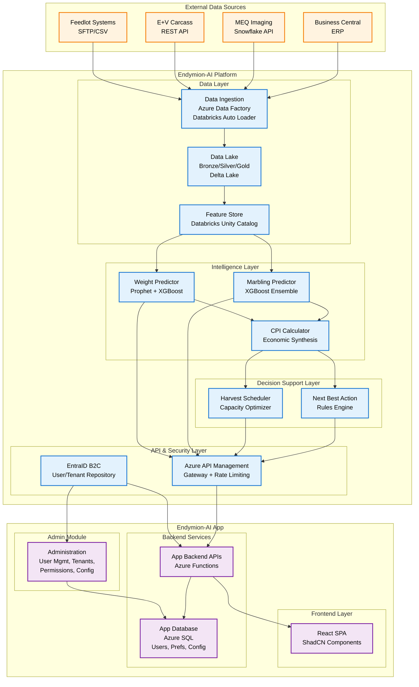
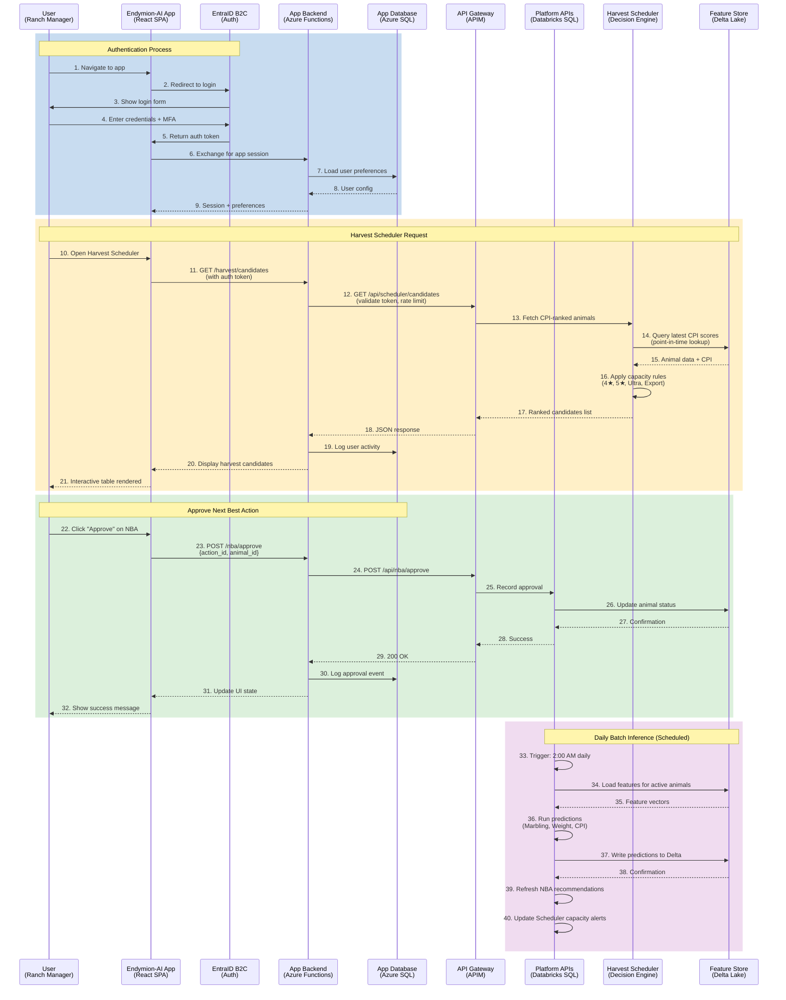
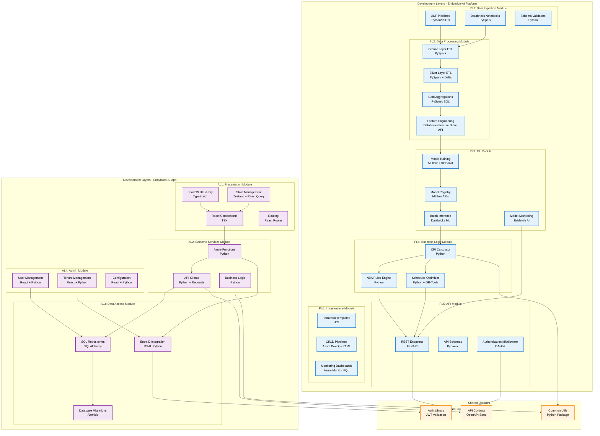
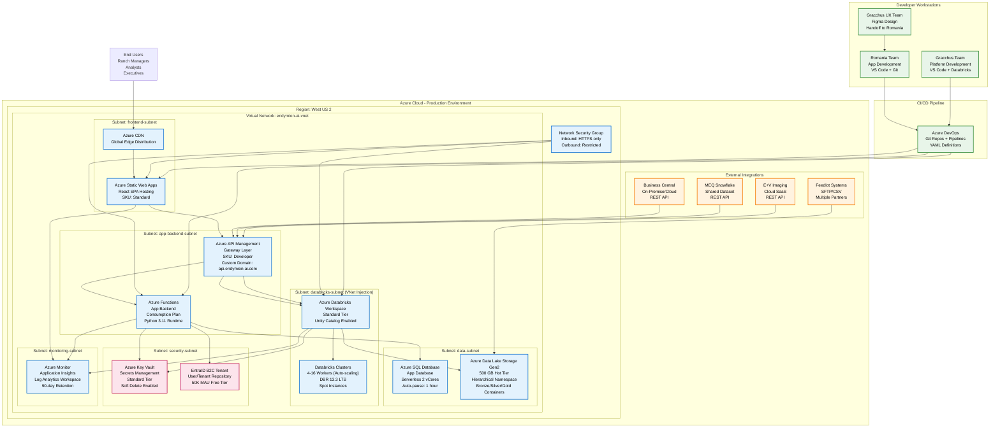
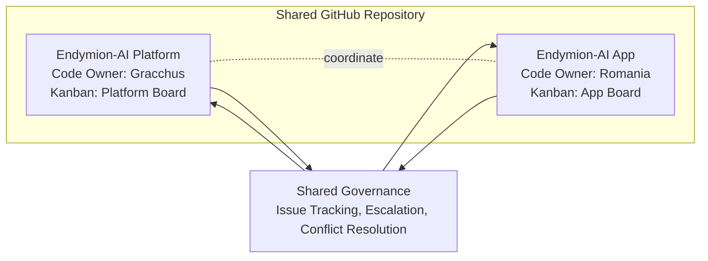

# Endymion-AI Platform - 4+1 Architecture Views

## Overview of 4+1 Architecture Framework

The 4+1 architectural view model organizes the description of a software architecture using five concurrent views:
1. **Logical View** - System functionality (components, classes, relationships)
2. **Process View** - Runtime behavior (concurrency, performance, scalability)
3. **Development View** - Software module organization (packages, libraries, layers)
4. **Physical View** - Deployment topology (servers, networks, infrastructure)
5. **Scenarios (Use Cases)** - Tying it all together through user journeys

**Plus:** **Team Execution View** - Division of work and responsibilities

For Endymion-AI, the 4+1 framework anchors every conversation between engineering, data science, and product stakeholders. Each view gives the teams a repeatable way to evaluate design decisions against the overarching goal: reliably translating messy agricultural data into predictive insights that feed the app experience. These decisions remain preliminary and will evolve as discovery deepens, but keeping the views synchronized ensures the platform can adapt without losing sight of how changes impact end users, runtime performance, code maintainability, or the production rollout strategy.

### Overall View

*All architectural choices captured here represent the current draft direction and will be revisited as discovery, pilot feedback, and cost modeling continue.*

## View 1: Logical View (Component Architecture)

### Purpose
Shows the key abstractions in the system as objects or classes, focusing on the **functional requirements** and how the system delivers value to end users.

This view highlights how the platform stitches together heterogeneous datasets, model pipelines, and delivery mechanisms into a cohesive product. It makes explicit where system boundaries lie, which services own core responsibilities, and how data flows from raw ingestion to decision-ready outputs. The diagram also doubles as a communication artifact for onboarding new contributors who need to understand "who talks to whom" before diving into code, while acknowledging that component assignments may shift as we validate assumptions with SML.

### Key Logical Components

| Component | Responsibility | Technology |
|-----------|----------------|------------|
| **Data Ingestion** | Acquire data from external sources | Azure Data Factory, Databricks Auto Loader |
| **Data Lake** | Store raw, cleaned, and aggregated data | Delta Lake (Bronze/Silver/Gold) |
| **Feature Store** | Maintain versioned, point-in-time features | Databricks Feature Store + Unity Catalog |
| **Predictive Models** | Generate forecasts (marbling, weight, CPI) | MLflow, XGBoost, Prophet |
| **Decision Support** | Translate predictions into recommendations | Python rules engines |
| **API Gateway** | Secure and route API requests | Azure API Management |
| **EntraID** | Authenticate users, manage tenants | Azure AD B2C |
| **App Backend** | Business logic for UI | Azure Functions (Python) |
| **App Database** | Store user preferences, config | Azure SQL Database |
| **Frontend** | User interface | React + ShadCN |

---

## View 2: Process View (Runtime Behavior)

### Purpose
Describes the system's **runtime behavior** including concurrency, processes, threads, and how components communicate at runtime.

Elaborating on runtime behavior clarifies how the platform must scale on peak days, which hand-offs require strong SLAs, and where resilience patterns should be applied. The process view also exposes implicit dependencies, such as the reliance of user-facing responsiveness on feature-store latency, so that performance budgets can be tracked during implementation and observability can be layered where it matters most. All timings and concurrency targets are candidates for refinement as usage patterns become clearer.

### Key Process Characteristics

| Process | Execution Model | Frequency | Concurrency |
|---------|----------------|-----------|-------------|
| **User Authentication** | Synchronous | Per session (30 min timeout) | 100 concurrent users |
| **API Requests** | Synchronous (HTTP REST) | Per user action | 1000 req/min (rate limited) |
| **Batch Inference** | Asynchronous (scheduled) | Daily at 2:00 AM | Single-threaded (20 min duration) |
| **Feature Refresh** | Asynchronous (triggered) | Daily at 1:00 AM | Parallel (16 Spark workers) |
| **Data Ingestion** | Asynchronous (event-driven) | Hourly (MEQ), Daily (others) | Parallel per source |

---

## View 3: Development View (Module Organization)

### Purpose
Describes the system's **static organization** in terms of layers, packages, modules, and their dependencies. This is the developer's view.

The development view spells out how the codebase is partitioned to keep data engineering, machine learning, and app development moving in parallel. By documenting module boundaries, technology stacks, and upstream/downstream relationships, we reduce accidental coupling and provide a roadmap for repository structure, CI/CD responsibilities, and backlog planning. Teams can use this section to identify where to enforce linting, testing, and documentation standards, understanding that module boundaries may be rearranged as implementation lessons emerge.

### Module Dependencies & Ownership

| Module | Primary Language | Key Dependencies | Team Owner |
|--------|-----------------|------------------|------------|
| **Platform - Data Ingestion** | Python, PySpark | Azure SDK, Databricks | Gracchus |
| **Platform - Data Processing** | PySpark, SQL | Delta Lake, Unity Catalog | Gracchus |
| **Platform - ML** | Python | MLflow, XGBoost, Prophet, Scikit-learn | Gracchus |
| **Platform - Business Logic** | Python | NumPy, Pandas, OR-Tools | Gracchus |
| **Platform - API** | Python (FastAPI) | Pydantic, JWT | Gracchus |
| **App - Presentation** | TypeScript, React | ShadCN, Zustand, React Query | Romania |
| **App - Backend Services** | Python | FastAPI, Requests | Romania |
| **App - Data Access** | Python | SQLAlchemy, MSAL, Alembic | Romania |
| **App - Admin** | TypeScript, Python | React, SQLAlchemy | Romania |
| **Shared Libraries** | Python, OpenAPI | JWT, JSON Schema | Joint (defined Month 2) |

---

## View 4: Physical View (Deployment Architecture)

### Purpose
Shows how the software is **deployed** on hardware/cloud infrastructure, including servers, networks, storage, and physical topology.

This view clarifies the shared responsibility model between cloud services, highlights the network controls safeguarding PII and operational data, and frames the trade-offs between cost and elasticity. It guides infrastructure-as-code definitions, environment parity across dev/stage/prod, and the playbook for responding to incidents. Use it as the authoritative source when coordinating with security or platform operations, while noting that SKUs and deployment footprints will be revisited after performance and cost testing.

### Infrastructure Specifications

| Component | Azure Service | SKU/Tier | Rationale |
|-----------|--------------|----------|-----------|
| **Frontend Hosting** | Azure Static Web Apps | Standard | Global CDN, auto-HTTPS, git integration |
| **API Gateway** | Azure API Management | Developer (MVP) | Rate limiting, OAuth validation, API routing |
| **App Backend** | Azure Functions | Consumption Plan | Serverless auto-scaling, pay-per-execution |
| **App Database** | Azure SQL Database | Serverless, 2 vCores | Auto-pause for cost savings, suitable for <100 users |
| **Data Lake** | ADLS Gen2 | Hot Tier, 500 GB | Hierarchical namespace for Delta Lake |
| **Big Data Processing** | Azure Databricks | Standard, Auto-scaling | Unified lakehouse for data + ML |
| **Secrets Management** | Azure Key Vault | Standard | API keys, connection strings, certificates |
| **Authentication** | EntraID B2C | Free (50K MAU) | Enterprise SSO, MFA, tenant isolation |
| **Monitoring** | Azure Monitor | Pay-as-you-go | Application Insights, Log Analytics |

### Network Security

| Layer | Protection | Implementation |
|-------|-----------|----------------|
| **Perimeter** | DDoS Protection | Azure DDoS Standard (future) |
| **Network** | Network Security Groups | Allow HTTPS (443), deny all others |
| **API** | Rate Limiting | APIM: 1000 req/min per user |
| **Data** | Private Endpoints | SQL, Storage, Databricks use private IPs |
| **Identity** | MFA | EntraID B2C enforces MFA for all users |
| **Secrets** | Key Vault | No credentials in code; managed identities |

---

## View 5: Scenarios (Use Case View)

### Purpose
Ties together the other views by showing **how key use cases** flow through the architecture. This validates that the architecture supports business requirements.

Each scenario emphasizes a business outcome that Endymion-AI Livestock cares about and demonstrates how the platform's components collaborate to deliver it. By mapping user journeys end-to-end, we ensure that cross-team contracts (data freshness, API semantics, auth flows) are explicitly validated. The section is also a living backlog for automated testing and monitoring, and the scenarios themselves will evolve as new insights surface during pilot usage or scope changes.

```mermaid
graph LR
    subgraph "Scenario 1: Daily Operations - Harvest Planning"
        S1A[Ranch Manager<br/>Logs In] --> S1B[Authenticates<br/>via EntraID]
        S1B --> S1C[Loads Harvest<br/>Scheduler UI]
        S1C --> S1D[Requests CPI-Ranked<br/>Candidates via API]
        S1D --> S1E[Platform Returns<br/>Predictions from<br/>Feature Store]
        S1E --> S1F[Displays Animals<br/>Ready for Harvest]
        S1F --> S1G[Adjusts Harvest<br/>Dates via Drag-Drop]
        S1G --> S1H[Saves Schedule<br/>to App Database]
        S1H --> S1I[Exports to<br/>Feedlot System]
    end
    
    subgraph "Scenario 2: Model Training & Deployment"
        S2A[Data Scientist<br/>Reviews Model<br/>Accuracy Drop Alert] --> S2B[Triggers Retraining<br/>Pipeline in Databricks]
        S2B --> S2C[Loads Training Data<br/>from Feature Store]
        S2C --> S2D[Trains New<br/>Marbling Model<br/>XGBoost]
        S2D --> S2E[Validates on<br/>Holdout Set]
        S2E --> S2F{Accuracy<br/>Improved?}
        S2F -->|Yes| S2G[Registers Model<br/>in MLflow]
        S2F -->|No| S2H[Logs Failure<br/>Investigates Features]
        S2G --> S2I[Runs A/B Test<br/>Shadow Scoring]
        S2I --> S2J[Promotes to<br/>Production]
        S2J --> S2K[Platform Uses<br/>New Model for<br/>Predictions]
    end
    
    subgraph "Scenario 3: New Tenant Onboarding"
        S3A[Admin User<br/>Creates New Tenant<br/>in Admin Module] --> S3B[Writes Tenant<br/>to EntraID<br/>via LDAP]
        S3B --> S3C[EntraID Generates<br/>Tenant ID]
        S3C --> S3D[App Creates<br/>Tenant Record<br/>in App DB]
        S3D --> S3E[Links via<br/>EntraID Tenant ID]
        S3E --> S3F[Admin Adds<br/>Users to Tenant]
        S3F --> S3G[Users Receive<br/>Invite Emails]
        S3G --> S3H[Users Authenticate<br/>See Tenant-Specific<br/>Data Only]
    end
    
    subgraph "Scenario 4: Data Ingestion & Feature Refresh"
        S4A[Hourly Trigger<br/>2:00 PM] --> S4B[ADF Pipeline<br/>Fetches MEQ Data]
        S4B --> S4C[Writes to<br/>Bronze Layer<br/>Delta Lake]
        S4C --> S4D[Data Quality<br/>Validation]
        S4D --> S4E{Quality<br/>Check Pass?}
        S4E -->|Yes| S4F[Transforms to<br/>Silver Layer]
        S4E -->|No| S4G[Alerts Data<br/>Engineering Team]
        S4F --> S4H[Triggers Feature<br/>Engineering Pipeline]
        S4H --> S4I[Updates Feature<br/>Store with Latest<br/>MEQ Values]
        S4I --> S4J[Feature Store<br/>Available for<br/>Next Prediction]
    end
    
    subgraph "Scenario 5: NBA Recommendation Approval"
        S5A[Operations Manager<br/>Opens NBA Dashboard] --> S5B[Sees Top 20<br/>Recommendations<br/>Ranked by ROI]
        S5B --> S5C[Reviews<br/>'Harvest Animal 12345']
        S5C --> S5D[Clicks Approve]
        S5D --> S5E[App Backend<br/>Validates Permission]
        S5E --> S5F[Platform Updates<br/>Animal Status<br/>in Feature Store]
        S5F --> S5G[Logs Approval<br/>Event with Timestamp]
        S5G --> S5H[Updates NBA<br/>Acceptance Rate<br/>Metric]
        S5H --> S5I[Sends Notification<br/>to Feedlot System]
    end
    
    style S1A fill:#B3E5FC
    style S2A fill:#C8E6C9
    style S3A fill:#FFE0B2
    style S4A fill:#F8BBD0
    style S5A fill:#D1C4E9
```

### Scenario Summary

| Scenario | Primary Actors | Key Systems | Business Value |
|----------|----------------|-------------|----------------|
| **1. Harvest Planning** | Ranch Manager | App UI, Platform Scheduler, Feature Store | Optimize harvest timing → reduce feed costs |
| **2. Model Training** | Data Scientist | Databricks, MLflow, Feature Store | Maintain model accuracy → reliable predictions |
| **3. Tenant Onboarding** | Admin User | Admin Module, EntraID, App DB | Enable multi-tenant SaaS → scalability |
| **4. Data Ingestion** | Automated System | ADF, Databricks, Delta Lake | Fresh data → current predictions |
| **5. NBA Approval** | Operations Manager | App UI, Platform APIs, Feature Store | Act on recommendations → ROI realization |

---

## Team Execution View (Collaboration Model)

The collaboration model keeps responsibilities crisp while giving both teams shared governance for cross-cutting concerns. Assignments are still in draft, yet both sides agree on the working principles so we can iterate quickly without blurring accountability.

- **Gracchus team** owns the Endymion-AI Platform end-to-end (data, ML, APIs, identity, Scheduler/NBA/Reporting engines) and leads production readiness for platform services.
- **Romania team** owns the Endymion-AI App (frontend, backend services, admin experience) and leads user-facing release management.

Both workstreams live in a single GitHub repository to simplify dependency management and code reuse. The repo inherits common policies for issue tracking, escalation, and conflict resolution so there is one source of truth when blockers surface. Within that shared governance, each team manages its own Kanban board, issue triage, and delivery cadences to keep platform and app velocity aligned while respecting local priorities.

These team boundaries will be reviewed during the pilot phase; any shifts in scope or runbook ownership will have to be agreed and signed off by all levels of this project, with the corresponding upstream and downstream changes in architecture.

